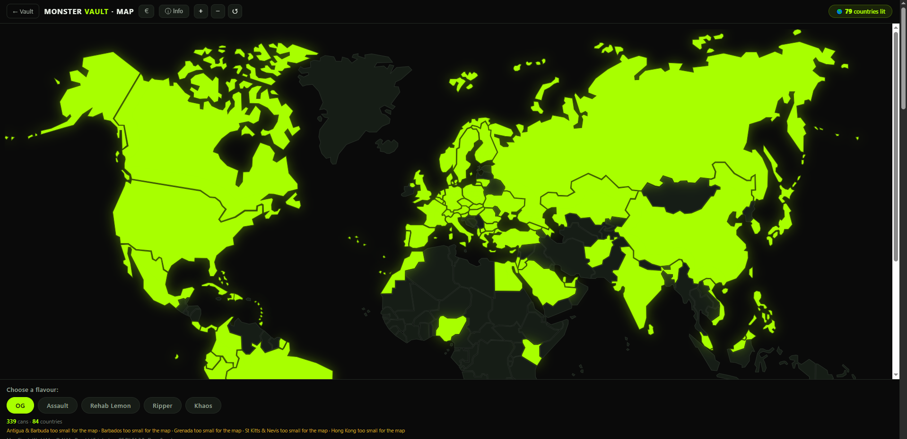
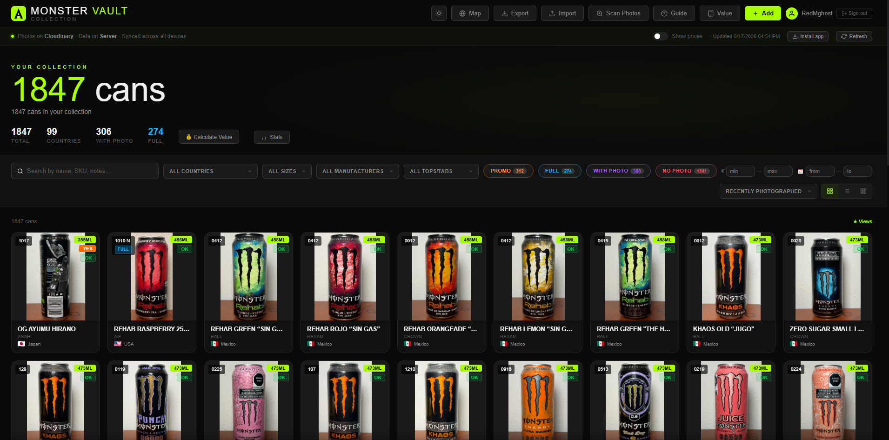
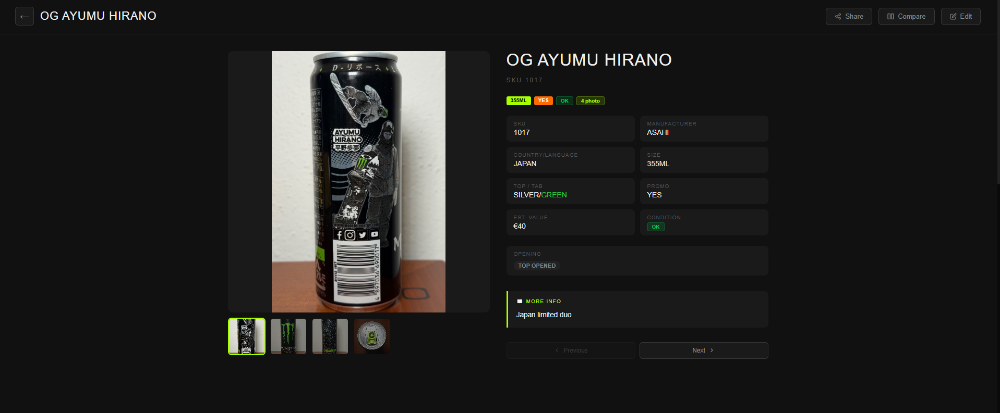

# 🥤 Monster Vault

> Catalog, value, and explore a Monster Energy can collection — with an interactive world map, a combinable‑filter value calculator, multiple gallery views, and a companion eBay rarity monitor.


[](LICENSE)
[](https://monster-vault-server.onrender.com)

**Monster Vault** is a full‑stack app for managing a large Monster Energy can collection (1,800+ cans). It's a monorepo: a **`backend/`** Spring Boot 3.3 / Java 17 service exposing a stateless JWT REST API (Firestore + Cloudinary), and a **`frontend/`** TypeScript Progressive Web App (modular, bundled with Vite). The built frontend is embedded into the backend's static resources at build time, so it's served same‑origin — no CORS. Auth uses a short‑lived access token plus a rotating refresh token in an HttpOnly cookie.

**🔗 Live demo:** https://monster-vault-server.onrender.com

## ✨ Features

- 🗺️ **Interactive world map** — every country you own a can from lights up; pick a flavour (OG, Khaos, Assault, Rehab, Ripper…) to see where it's collected, with a grouped list and a "missing countries" overview.
- 🧮 **Value calculator** — fully combinable filters (country, flavour, size, full/promo, photo, SKU, year…) that only ever offer *possible* values; results grouped by a field of your choice with per‑group subtotals and a grand‑total €.
- 🖼️ **Three gallery views** — responsive grid, dense list, and a photo "wall"; full‑screen lightbox with pinch‑zoom and keyboard navigation.
- 📊 **Stats & insights** — collection breakdowns, Top 10 most valuable, and a value‑over‑time timeline.
- 📱 **Installable PWA** — offline‑ready service worker, add‑to‑home‑screen, mobile‑tuned UI.
- 🔍 **eBay rarity monitor** *(companion tool)* — a Python service that watches eBay across multiple marketplaces (Browse API + OAuth2) and pings Telegram when rare cans appear, with configurable saved searches and keyword filters.
- 🔒 **Admin & guest modes** — JWT‑authenticated editing; public, read‑only share links.
- 📈 **Observability** — Spring Boot Actuator + Micrometer expose Prometheus metrics (HTTP, JVM + a custom `monstervault_cans_active` gauge); local **Grafana** dashboards via docker-compose ([`observability/`](observability/)).

## 📸 Screenshots

> ▶️ **Try it live:** **[monster-vault-server.onrender.com](https://monster-vault-server.onrender.com)**

### 🗺️ Interactive world map


| Collection grid | Can detail |
|---|---|
|  |  |

---

## Architecture

### System overview

```
        Browser / PWA  (TypeScript modules · Vite · installable · offline)
                │  HTTPS · REST · JWT access token + refresh cookie (stateless)
                ▼
        ┌───────────────────────────────────────────┐
        │  Spring Boot API  (Java 17)                │
        │  Controller → Service → Repository         │
        │  SOLID · layered · in-memory cache         │
        └───────┬───────────────────────┬───────────┘
                │                        │
           Firestore (NoSQL)       Cloudinary (photos)

   ── Cross-cutting ──────────────────────────────────────────
   Observability : /actuator/prometheus → Prometheus → Grafana
   CI/CD         : GitHub Actions (backend tests · frontend lint/build · Playwright E2E) → Docker → Render
   Orchestration : Kubernetes manifests (Deployment/Service) · minikube
   IaC / Cloud   : Terraform → GCP Cloud Run + Artifact Registry (infra/)
   SEO / AEO     : robots.txt · sitemap.xml · llms.txt · JSON-LD · /share/{id} OG meta
   Companion     : Python eBay monitor → Telegram alerts
```

### Backend request flow

```
HTTP Request
     │
     ▼
JwtFilter          ← reads Authorization: Bearer <token>, validates it,
     │               sets authentication in Spring SecurityContext
     ▼
SecurityConfig     ← decides if the route is public or requires authentication
     │
     ▼
Controller         ← receives the HTTP request, delegates to services
  ├── AuthController   → POST /api/auth/login · /refresh (cookie) · /logout
  ├── CanController    → CRUD /api/cans, photo upload
  └── ShareController  → GET /share/{id} (dynamic Open Graph meta)

     │
     ▼
Service            ← business logic
  ├── AdminAuthService  → verifies credentials, issues access + refresh tokens (rotation)
  ├── CanService        → in-memory cache + delegates to repository
  └── CloudinaryService → uploads photos to Cloudinary
  + RefreshTokenStore   → in-memory store of active refresh tokens (SHA-256 hashed)

     │
     ▼
Repository         ← data persistence
  └── FirestoreCanRepository → reads/writes to Firestore (Google Firebase)
```

Every layer depends on **interfaces**, not on concrete classes (SOLID Dependency Inversion Principle).
This makes each component independently testable with mocks.

---

## Technology Stack

| Layer | Technology |
|---|---|
| Framework | Spring Boot 3.3.0 (Java 17) |
| Security | Spring Security + JWT (jjwt 0.12.3) |
| Password hashing | BCrypt |
| Database | Google Firestore (Firebase Admin SDK 9.3.0, paginated 500 docs/page) |
| Photo storage | Cloudinary |
| Validation | Jakarta Validation (`@NotBlank`) |
| Boilerplate reduction | Lombok 1.18.38 (`@Data`, `@Slf4j`) |
| Rate limiting | Bucket4j 8.10.1 — 10 login attempts/min per IP (LRU-bounded IP map) |
| API docs | SpringDoc OpenAPI 2.6.0 — Swagger UI at `/swagger-ui.html` |
| Observability | Spring Boot Actuator, Micrometer, Prometheus, Grafana |
| Containerization | Docker (3-stage: Node/Vite build → Maven build → JRE runtime) |
| Hosting | Render free tier |
| Frontend | TypeScript (strict) · Vite bundler · ESLint · Prettier · PWA (manifest + service worker) |
| Orchestration | Kubernetes (Deployment/Service/ConfigMap/Secret) — local minikube |
| IaC | Terraform — GCP Cloud Run + Artifact Registry (`infra/`) |
| CI/CD | GitHub Actions — backend tests · frontend lint/format/build · Playwright E2E |
| Testing | JUnit + Mockito · Selenium (E2E) · Playwright (frontend smoke) |
| Companion tool | Python eBay monitor (Browse API + Telegram) |

---

## API Endpoints

### Authentication

| Method | Path | Auth | Description |
|---|---|---|---|
| POST | `/api/auth/login` | Public | Valid credentials → access token in body + refresh token in an HttpOnly cookie |
| POST | `/api/auth/refresh` | Refresh cookie | Reads the refresh cookie, rotates it, returns a fresh access token |
| POST | `/api/auth/logout` | Refresh cookie | Revokes the refresh token and clears the cookie |

**Request body (login):**
```json
{ "username": "admin", "password": "yourpassword" }
```
**Response 200:**
```json
{ "accessToken": "<short-lived JWT>" }
```
…plus a `Set-Cookie: mv_refresh=<JWT>; HttpOnly; Secure; SameSite=Strict; Path=/api/auth`.
**Response 401:** Invalid credentials.

---

### Can Collection

| Method | Path | Auth | Description |
|---|---|---|---|
| GET | `/api/cans` | Public | Returns all cans |
| GET | `/api/cans/{id}` | Public | Returns a single can, 404 if not found |
| POST | `/api/cans` | JWT | Creates a new can |
| PUT | `/api/cans/{id}` | JWT | Updates an existing can (orphan photos cleaned from Cloudinary) |
| DELETE | `/api/cans/{id}` | JWT | Soft-deletes a can (sets `deletedAt`; hidden from `GET`, photos kept) |
| DELETE | `/api/cans/{id}/permanent` | JWT | Permanent delete — removes from Firestore + Cloudinary |
| PUT | `/api/cans/{id}/restore` | JWT | Restores a soft-deleted can |
| POST | `/api/cans/batch` | JWT | Atomically saves multiple cans (Excel import) |
| DELETE | `/api/cans` | JWT + header | Deletes the entire collection |

For `DELETE /api/cans` a confirmation header is required to prevent accidental deletion:
```
X-Confirm-Delete: all
```

---

### Photo Upload

| Method | Path | Auth | Description |
|---|---|---|---|
| POST | `/api/cans/{id}/photo/{slot}` | JWT | Upload a photo file (multipart) |
| POST | `/api/cans/{id}/photo/{slot}/from-url` | JWT | Upload a photo from an external URL |

- `slot` is 1–4 (each can has up to 4 photos: p1, p2, p3, p4)
- Photos are stored on Cloudinary; the returned HTTPS URL is saved in Firestore

**File upload** — `multipart/form-data`, field name: `file`  
**URL upload** — JSON body: `{ "url": "https://example.com/image.jpg" }`  
**Response:** `{ "url": "https://res.cloudinary.com/..." }`

---

## Authentication Flow

```
1. Client → POST /api/auth/login { username, password }
2. Server → BCrypt verifies password against stored hash
3. Server → issues an access token (HMAC-SHA256, ~15 min, type=access)
            and a refresh token (~7 days, type=refresh) stored in RefreshTokenStore
4. Client ← { "accessToken": "eyJ..." }  +  Set-Cookie: mv_refresh (HttpOnly)
            access token kept in memory (not localStorage → XSS-resilient)

5. Client → GET /api/cans  Authorization: Bearer eyJ...   (writes require this)
6. JwtFilter → accepts ONLY access tokens (checks the `type` claim)

7. On 401 (access expired) → client POSTs /api/auth/refresh (cookie sent
   automatically) → server rotates the refresh token, returns a new access
   token → client retries the original request. On boot the same call
   silently restores the session from the cookie.
8. Logout → POST /api/auth/logout revokes the refresh token + clears the cookie.
```

The server is **stateless** for access (signature-verified JWT); the only server-side state is the in-memory set of active refresh-token hashes (rotation/revocation), which resets on restart — acceptable for a single-admin app.

---

## In-Memory Cache

`CanService` maintains a thread-safe in-memory cache of the entire collection to avoid hitting the Firestore daily read quota (50,000 reads/day free tier with ~1,800 documents).

```
cache = null        → cold cache: next getAll() reads from Firestore
cache = []          → known empty collection: no Firestore read needed
cache = [Can, ...]  → warm cache: all reads served from memory
```

**Thread safety:**
- `volatile` keyword: ensures every thread sees the latest written value
- `CopyOnWriteArrayList`: allows concurrent reads without blocking
- `synchronized` + double-checked locking in `getAll()`: prevents two threads from loading Firestore simultaneously on the first request

**ACID Consistency:** if any Firestore write fails, the cache is set to `null` so the next read reloads from the database — cache and Firestore can never diverge.

---

## Project Structure

Monorepo with two top-level apps. The frontend is built and copied into the backend's
`static/` at Docker build time, so production serves everything same-origin.

```
.
├── Dockerfile                            # 3-stage: Vite build → Maven build → JRE runtime
├── backend/                              # Spring Boot service
│   ├── pom.xml
│   └── src/main/java/com/monstervault/
│       ├── MonsterVaultApplication.java
│       ├── model/Can.java                # photoAt: Long; p1Id-p4Id: Cloudinary public_id
│       ├── config/                       # FirebaseConfig, SecurityConfig, WebConfig, OpenApiConfig
│       ├── security/
│       │   ├── TokenValidator / TokenGenerator   # interfaces (access + refresh aware)
│       │   ├── JwtUtil.java              # HMAC-SHA256; access/refresh tokens, `type` claim
│       │   ├── JwtFilter.java            # accepts only access tokens
│       │   ├── RefreshTokenStore.java    # in-memory active refresh tokens (SHA-256 hashed)
│       │   └── LoginRateLimitInterceptor.java
│       ├── repository/                   # CanRepository + FirestoreCanRepository
│       ├── service/
│       │   ├── AuthService / AdminAuthService     # login → AuthResponse, refresh+rotation, logout
│       │   ├── AuthResponse.java         # record(accessToken, refreshToken)
│       │   ├── CanService.java           # cache + photo orchestration
│       │   └── PhotoStorage / CloudinaryService
│       ├── controller/                   # AuthController, CanController, ShareController, GlobalExceptionHandler
│       └── exception/FirestoreQuotaExceededException.java
└── frontend/                             # TypeScript PWA (Vite)
    ├── index.html                        # Vite entry (markup only)
    ├── vite.config.ts · tsconfig.json · eslint.config.js · .prettierrc
    ├── src/
    │   ├── main.ts                       # entry: wires modules, exposes them on window
    │   ├── core.ts                       # state, API, auth, cache, utils
    │   ├── ui.ts                         # filters, views, detail, edit, boot
    │   ├── tools.ts                      # stats, value calculator, import/export
    │   ├── photos.ts · share.ts · pwa.ts · types.ts
    │   └── styles/main.css
    ├── public/                           # sw.js, map.html, manifest.json, robots.txt, sitemap.xml, llms.txt, images
    └── tests/
        ├── frontend.test.js              # legacy Jest unit suite
        └── e2e/smoke.spec.ts             # Playwright smoke tests (run in CI)
```

---

## Running Locally

### Prerequisites
- **JDK 17** (matches the Docker/Render target)
- Maven 3.9.x · **Node 22** (for the frontend build)
- A `backend/src/main/resources/application.properties` file (not committed — see below)
- A `backend/src/main/resources/firebase-service-account.json` file (not committed)

### application.properties

```properties
server.port=8080
firestore.collection=cans
app.admin.username=YourAdminUsername
app.admin.password=$2a$10$<bcrypt_hash_of_your_password>
app.jwt.secret=<random_string_at_least_32_chars>
app.jwt.access-expiration=900000        # access token, 15 min
app.jwt.refresh-expiration=604800000    # refresh token, 7 days
app.jwt.refresh-cookie-secure=false     # set false only for local HTTP dev
cloudinary.cloud-name=<your_cloud_name>
cloudinary.api-key=<your_api_key>
cloudinary.api-secret=<your_api_secret>
firebase.service-account=src/main/resources/firebase-service-account.json
```

### Frontend (dev)

```bash
cd frontend
npm ci
npm run dev        # Vite dev server on :5173, proxies /api → :8080
# build + checks:
npm run build      # tsc --noEmit && vite build → dist/
npm run lint && npm run format:check
npm run test:e2e   # Playwright smoke tests (needs `npx playwright install chromium` once)
```

### Backend (tests + run)

```bash
cd backend
# Windows (PowerShell) — JDK 17 (avoid JDK 25: Lombok TypeTag::UNKNOWN)
$env:JAVA_HOME = "C:\Program Files\Eclipse Adoptium\jdk-17.0.14.7-hotspot"
.\mvnw.cmd test
.\mvnw.cmd spring-boot:run     # serves API + whatever is in src/main/resources/static/

# Linux / macOS
mvn test
```

> To serve the frontend locally from Spring Boot, build it first and copy the
> output: `npm --prefix frontend run build && cp -r frontend/dist/* backend/src/main/resources/static/`.
> The Docker build does this automatically.
> The Windows wrapper `mvnw.cmd` requires CRLF line endings (`.gitattributes` pins `*.cmd`).

---

## Test Suite

### Backend — 82 unit/integration + 58 E2E (Selenium)

| File | What it covers |
|---|---|
| `CanServiceTest` | Cache warm/cold, save/update/softDelete/restore/permanentDelete with Cloudinary cleanup, InOrder save-before-delete, deleteFolder, failure resilience |
| `AdminAuthServiceTest` | Login → `AuthResponse`, refresh with rotation, logout/revocation |
| `RefreshTokenStoreTest` | store / isActive / revoke / revokeAllForUser, SHA-256 hashing |
| `JwtUtilTest` | Access vs refresh tokens, `type` claim, dual expirations, invalid/expired |
| `AuthControllerTest` | Login sets HttpOnly cookie + access body, refresh rotates cookie, logout clears it |
| `CanControllerTest` | Full CRUD with/without JWT, soft-delete/restore/permanent, @Valid, deleteAll header |
| `SecurityHeadersTest` | ETag/304, CSP, X-Frame-Options, nosniff, Referrer-Policy, Permissions-Policy |

Controller tests use `@WebMvcTest` with `@Import({SecurityConfig.class, JwtUtil.class})` so the JWT filter loads in the test context.

**E2E (Selenium, headless Chrome)** — `AdminFlowE2ETest`, `GuestFlowE2ETest`, `ResponsiveE2ETest` = 58 tests. The base class mocks Firebase/Firestore/repository/storage; admin tests inject the access token into memory and force admin UI via the window-exposed functions (the new in-memory auth flow). **These need a local Chrome and are skipped on the CI runner** — run them locally with `mvn test`.

### Frontend — Playwright smoke (CI) + legacy Jest

- **Playwright smoke** (`frontend/tests/e2e/smoke.spec.ts`, runs in CI): builds the frontend, serves it via `vite preview` with the API mocked (`page.route`), and asserts the app loads, the grid renders, photo detail opens, admin Add opens the edit modal, and vault→map→back still renders — **failing on any uncaught JS error**. This catches the kind of cross-module wiring bug a browserless suite can't.
  ```bash
  cd frontend && npx playwright install chromium && npm run test:e2e
  ```
- **Legacy Jest** (`frontend/tests/frontend.test.js`, jsdom): pure-function and behaviour tests against the pre-modularization `src/index.html`; kept as a reference suite. `cd frontend/tests && npm ci && npm test`.

| Suite | Tests | What it covers |
|---|---|---|
| `esc()` | 3 | XSS escaping: `< > & "`, null/undefined, plain text |
| `simpleHash()` | 3 | Non-empty output, determinism, different inputs → different hashes |
| `apiCall()` | 2 | `Authorization: Bearer` header, `extraHeaders` merging |
| `batchDeleteAllFS()` | 2 | Sends `X-Confirm-Delete: all` header, not sent on other DELETE calls |
| `shareCanLink()` | 6 | `can.lingua` used (not the removed `can.paese`), FULL detection from `can.note`, no-op when share name not set |
| `clearAll()` | 3 | localStorage cache emptied, in-memory `cans` cleared, confirm cancellation |
| `renderComparePanel()` | 4 | Est. Value hidden in guest mode, visible in admin mode |
| `statsFreq()` | 3 | Frequency map sorted desc, ignores empty values, respects limit (pure fn) |
| `buildStatsData()` | 3 | total/withPhoto/promo/fullCans/pct aggregation, empty-safe pct, case-insensitive FULL (pure fn) |
| `buildTimelineData()` | 2 | 12 monthly buckets, counts current month, excludes out-of-window (pure fn) |
| `renderTimeline()` | 2 | Empty string when no can has `updatedAt`; SVG + Months/Years toggle when data present |
| `buildYearlyData()` | 3 | Groups cans by year (all-time): count `n` + summed value `v`, ignores missing/non-numeric (pure fn) |
| `setTimelineMode()` | 1 | Switches the timeline months↔years; chart reflects the active mode |
| `setTimelineMetric()` | 1 | Switches the timeline Count↔€ Value; chart shows the amount |
| `jsq()` | 5 | XSS escaping for ids/values inside inline handlers: quote/backslash/HTML neutralised, hostile id rendered inert in `cardHTML` |
| `watch flag (eBay monitor)` | 4 | `watch` toggle on a can: eye button, `.watching` class, persisted on the can object |
| `colorizeTop()` | 5 | Top/Tab colour map: word after the slash rendered in its own colour (orange→arancione), escaped output |
| `captureFilterState() / applyFilterState()` | 3 | Saved-view filter round-trip: captures and re-applies search/select/year |
| `extractYearFromCan() / year filter from SKU` | 3 | Year decoded from SKU (`0610`→2010, `093`→2003); month >12 or bad format → excluded when filter active |
| `buildTopValue()` | 2 | Top 10 by value: descending sort, ignores non-numeric values (pure fn) |
| `renderWall()` | 2 | Wall view: only cans with photos, ids via jsq; `setView('wall')` activates the view |
| `cloudinaryThumb()` | 3 | CDN `c_fit` transform (whole can, no crop) + dimensions; non-Cloudinary/null URLs left unchanged |
| `lightbox: viewer foto` | 4 | `setLbPhoto` resets opacity (anti dark-photo) + 1600 CDN, 128 thumbs, arrows don't navigate the can underneath |
| `regressioni layout foto (CSS/markup)` | 5 | Guards: lightbox `#000`, `onload` opacity reset, mobile `100dvh` max-height, details `contain`, LQIP `background-image:none` |
| `calcolatore valore (filtri + somma)` | 11 | `calcMatch` per ogni criterio (gusto, paese multi-nation, full, promo, photo, SKU contains/starts/exact, year, AND), `calcTotals`, `calcGroups` (subtotals sorted desc), opzioni "solo possibili" (`calcDistinct` sul sottoinsieme filtrato) |
| `demo / fallback offline` | 1 | `showDemo` mostra le mock senza salvare (no cache, no POST) — regressione "2 lattine prova" su cold start |

### API — Newman collection

Located in `backend/src/test/api/monster-vault.collection.json`. Run with:

```bash
newman run backend/src/test/api/monster-vault.collection.json -e backend/src/test/api/local.environment.json
```

Covers: Auth (login OK/wrong-password/wrong-username), public GET, JWT-protected CRUD, batch save, `DELETE /api/cans` header enforcement, and self-cleaning test data.

---

## Deployment (Render)

The app is containerized with a multi-stage Dockerfile and deployed on Render free tier.

**Environment variables on Render:**

| Variable | Description |
|---|---|
| `FIREBASE_CREDENTIALS_JSON` | Base64-encoded Firebase service account JSON |
| `FIRESTORE_COLLECTION` | Firestore collection name (e.g. `cans`) |
| `APP_ADMIN_USERNAME` | Admin username |
| `APP_ADMIN_PASSWORD` | BCrypt hash of admin password |
| `APP_JWT_SECRET` | JWT signing secret (min. 32 chars) |
| `APP_JWT_ACCESS_EXPIRATION` | Access token expiry in ms (e.g. `900000` = 15 min) |
| `APP_JWT_REFRESH_EXPIRATION` | Refresh token expiry in ms (e.g. `604800000` = 7 days) |
| `CLOUDINARY_CLOUD_NAME` | Cloudinary cloud name |
| `CLOUDINARY_API_KEY` | Cloudinary API key |
| `CLOUDINARY_API_SECRET` | Cloudinary API secret |

**Cold start:** Render free tier spins down containers after 15 minutes of inactivity. First request after idle takes 30–50 seconds. Mitigated two ways — a scheduled **keep-warm** GitHub Action (`.github/workflows/keep-warm.yml`) pings `GET /api/cans` every 10 min during the day (UTC) so the container rarely sleeps (a free alternative to upgrading Render); and the frontend retries on cold start in two places:
- **Login:** retries `/api/auth/login` up to 3× (3s apart) on 5xx; shows "Server warming up…" message in the auth card after 5s
- **Data load:** retries `GET /api/cans` up to 3× (2s apart) on 5xx; updates the loading message to "Server warming up… Free tier cold start · usually 30–50s" on the first retry

---

## Key Design Decisions

**Access token + refresh token (rotation)** — a short-lived access token (15 min) is kept in memory and sent as `Authorization: Bearer` (XSS-resilient — not in localStorage); a long-lived refresh token (7 days) lives in an HttpOnly/Secure/SameSite=Strict cookie. Each refresh rotates the token (single-use) and is revoked on logout. Access stays stateless (signature-verified); only the small set of active refresh-token hashes is held in memory.

**Interface-based architecture (SOLID DIP)** — `CanService` depends on `CanRepository`, not on `FirestoreCanRepository`. Switching persistence layer means writing one new class, not modifying existing ones.

**In-memory cache instead of CDN/Redis** — free and sufficient for a single-user app. The cache is invalidated on any write failure to maintain consistency with Firestore.

**`deleteAll` requires a confirmation header** — prevents accidental erasure of 1,800+ documents from a misfire or curl typo.

**BCrypt short-circuit** — username is checked first (cheap string comparison), password BCrypt only runs if the username matches. Prevents wasting CPU on brute-force attempts with wrong usernames.

**Rate limiting on login** — `LoginRateLimitInterceptor` (Bucket4j) allows 10 login attempts per minute per IP. Uses `X-Forwarded-For` header to get the real client IP behind Render's proxy. The IP→bucket map is an **LRU-bounded** `LinkedHashMap` (cap 10,000 IPs) so a client rotating its source IP / `X-Forwarded-For` cannot grow the map without bound (memory-exhaustion DoS). Buckets reset on container restart (acceptable on free tier where containers sleep frequently).

**Frontend XSS escaping** — all dynamic text is rendered through `esc()` (HTML-entity encoding); any id/value interpolated into an inline `onclick="…('<value>')"` handler goes through `jsq()`, which neutralises the JS-string breakout (quote/backslash) and the attribute's HTML special chars. Because collections can be shared read-only to untrusted viewers and the CSP allows `'unsafe-inline'`, an un-escaped id (e.g. from an Excel import) would otherwise be a stored-XSS vector. Covered by Jest tests (`jsq()` + a hostile-id case rendered inert in `cardHTML`).

**Deterministic JWT signing key** — `JwtUtil` derives the HMAC key with `secret.getBytes(StandardCharsets.UTF_8)` rather than the platform default charset, so a token signed on Windows (Cp1252) verifies on Linux/Render (UTF-8) even if the secret contains non-ASCII characters.

**`<form>`-based login for mobile autofill** — the login form uses a proper HTML `<form autocomplete="on">` with `<button type="submit">`, which is required for iOS Safari Face ID and Android password managers to autofill and submit correctly. Without a `<form>` element browsers cannot map the autofill gesture to the submit action.

**`photoAt` timestamp** — each Can has a `photoAt: Long` field set to the current epoch milliseconds whenever any photo slot (p1–p4) is saved. The "Recently Photographed" sort uses this to surface recently-photographed cans first; cans with no photos (photoAt = null) sort to the bottom.

**Cloudinary cleanup order (safety invariant)** — Firestore is always written/deleted *before* touching Cloudinary. If the DB operation fails, photos are never deleted and the state remains consistent. If the Cloudinary operation fails, at worst photos are orphaned on Cloudinary (recoverable), but the DB is always correct. `deleteAll()` uses `deleteResourcesByPrefix` (one Admin API call per 1000 resources) instead of N individual `destroy()` calls.

**Cloudinary `publicId` stored alongside URL** — each Can stores `p1Id`–`p4Id` (the Cloudinary public_id, e.g. `monster-vault/abc_1_xyz`) set at upload time. Deletions use the stored ID directly — no URL parsing. Old cans without `pNId` fall back to URL parsing for backward compatibility.
